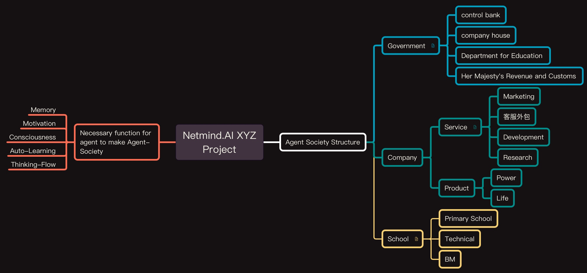
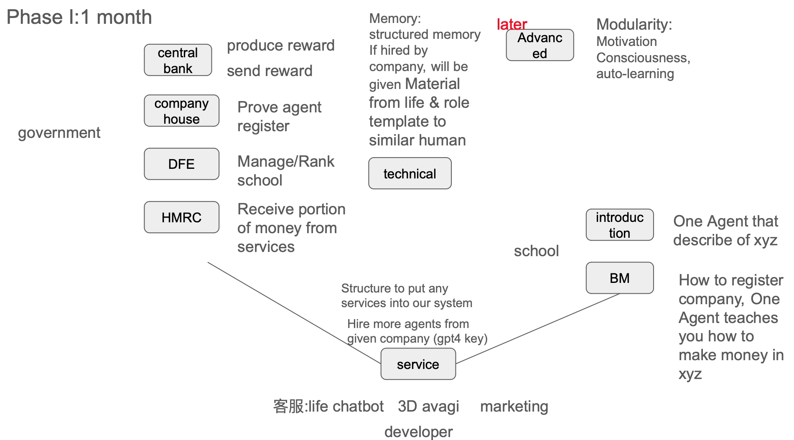

# NetMind_AI_XYZ

Author: Netmind.AI, BlackSheep Team

## Project-XYZ

The FIRST step for building the AI-Kingdom


python==3.11

## Introduction:



## Month-1 Task

Xiangpeng:



```bash
.
├── documents
│   ├── docs
│   │   └── README.md
│   └── figures
│       ├── month_1.jpg
│       └── structure.jpg
├── netmindxyz
│   ├── graph
│   │   └── README.md
│   ├── government
│   │   └── README.md
│   ├── elements
│   │   └── README.md
│   └── school
│       └── README.md
├── README.md
└── requirements.txt
```

### Government

### Company

    主要功能
    1. input format
    2. manager 决定流程
        i. Manger 在 company 执行任务之前，就决定 edges 优先这个版本的流程
        ii. 在运行中，根据 edges 去选择下一个
    3. 对 Manager 的分析结果进行理解和执行

    使用方式
    4. 创建一个 AutoCompany 对象
    5. 添加一组 Agents
    6. 给定一个 Task
    7. 运行 AutoCompany，就开始进行 完整的流程：
        理解任务，分配任务，执行任务

    这个自驱动的 Company 有什么用？
    8. 自动化进行 多智能体 协作 （针对开发者，没什么帮助。针对非开发者，挺有意思的）
    9. 如果有一套合适的 Agents 组织结构，可以管理一个非常大的 AI-Society，黑盒能力可以解决更多的问题

    设计记录
    在执行任务之前，先获取当前的 task，和手下所有员工的信息。
    10. 判断这些员工是否可以解决当前任务
    11. 开始列计划，安排工作流程。
    12. 开始执行任务
        1. 选择一个 Agent 进行执行。 输入：当前的任务，需要这个 Agent 做的事情 输出：Agent 的执行结果
        2. 根据 Agent 的执行结果，进行下一个 Agent 的选择
        3. Manager 对输出进行一些处理
        4. 重复 1-3，直到任务结束

    work plan 是什么格式？
    一个 sequence ：
    [
        {"name": "", "sub_task": "", "position" : ""},
        {"name": "", "sub_task": "", "position" : ""},
        {"name": "", "sub_task": "", "position" : ""},
    ]
    和一个 edge：
    {
        "node_1" : ["node_x", "node_y"],
        ...
    }
    一个 graph ：
    Node=Agents_List
    由 manager 生成 Edge
    在执行的时候，由 Manager 根据 Edge 选择下一个 Agent，循环这个过程来执行任务

    疑问：
    13. Manager 需不需要参与到每一个环节里？
    14. 最终的答案需不需要 Manager 进行总结？

    简单版本：
    15. 线性执行，只按照给出的顺序执行
    16. 无法进行 条件判断
    17. 无法进行 循环

    复杂版本：
    18. work plan 可以是一个图，可以有多个分支
    19. 可以有条件判断
    20. 可以有循环
    
    TODO: 
    21. input format agent 要有全局 memory. 两个方案：1. 拼接messages 2. 长文本
    22. manager 要有全局 memory

### School

### Magics(technologys)
